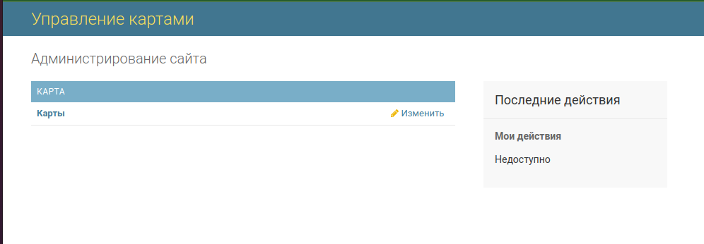
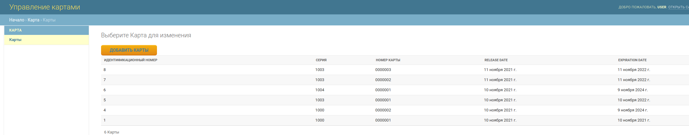
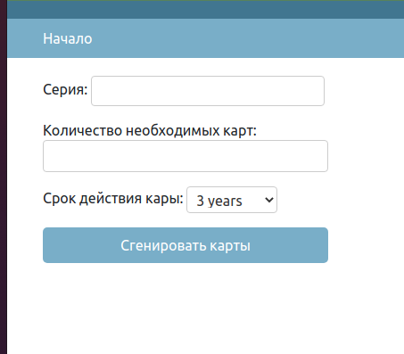
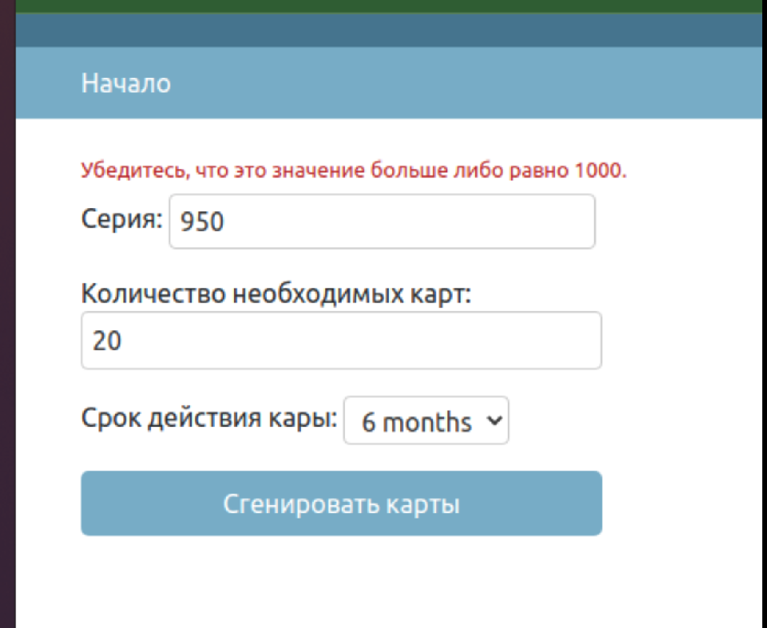

# app_card
the application was created as part of homework, as a preparation for an interview on a junior python developer
## Задача:
Необходимо создать веб-приложение на Django для управления базой данных карт.

Список полей карты: серия карты (4 цифры, начиная с 1000), номер карты (6 цифр, начиная с 000001), дата выпуска,
дата окончания

Приложение должно реализовывать возможность авторизоваться в системе, посмотреть список существующих карт
и сгенерировать новый пул карт.

При генерации карт требуется указать серию, количество карт и срок действия (3 года, 1 год, 6 месяцев, 1 месяц). 
Дата окончания = сегодня + срок действия.

## Решение:
Приложение написано на языке python с использованием фреймворка Django.
В качестве базы данных выбрана БД MYSQL. 

Для авторизации пользователя использована административная панель django:

Предполагается, что администратор сайта выдает пользователю логин и пароль,
а также определенные права, с которыми пользователь авторизуется в системе.
Личный кабинет стандартный:

В личном кабинете пользователь может просматривать имеющие карты:

 

Пользователь может видеть значения: Идентификационный номер, серию, номер карты,
дату релиза и срок годности, данные пагинируются по 15 записей, данные отформатированы
исходя из логики задачи
Пользователю доступна кнопка "Создать карты", по нажатию на которую попадаем в интерфейс
по генерации карт:

форма для генерации карт валидирует все значения:

серия от 1000 до 9999

количество необходимых карт от 1 до 999999

срок действия карты предоставляет выбор из значений: 3 года, 1 год, 6 месяце, 1 месяц

При попытке ввести не валидное значение форма выдаст ошибку:

Если все значение указаны правильно, то генерируется пулл кард, пользователя перенаправляет на 
список всех имеющихся карт, и выдается сообщение об успешной генерации количества карт

Требования:

серия карты (4 цифры, начиная с 1000) - реализовано

номер карты (6 цифр, начиная с 000001) - реализовано

Предположил, что **"серия + номер карты"** должны быть уникальны, реализовано дополнительным ограничением 
unique_together

для поля номер карты настроено отображение '000001' заполняем нулями до 6 - ти значного числа

дата выпуска заполняется по дефолту текущим днем

дата окончания = текущий день + срок действия.

срок действия - выбор из значений (3 года, 1 год, 6 месяцев, 1 месяц)

Если пользователь заказал единовременно более 1000 карт, создание карт идет пачками по 1000 шт

Создание карт, выполняется как транзакция

